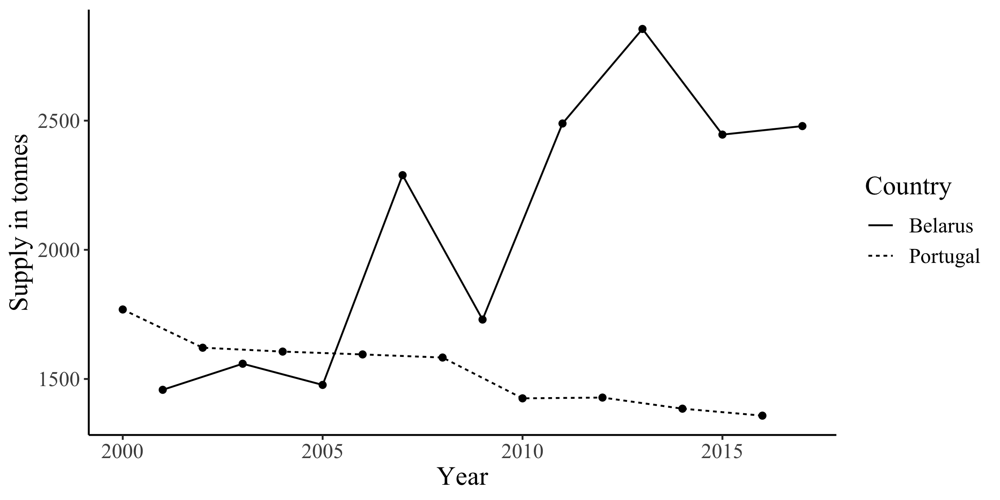
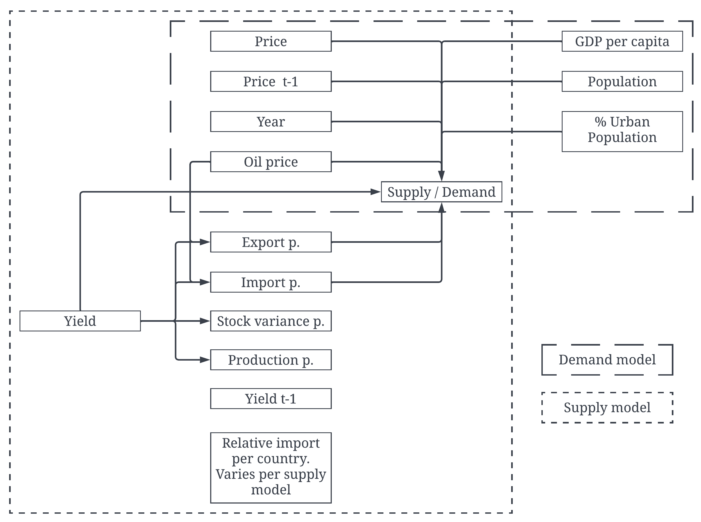
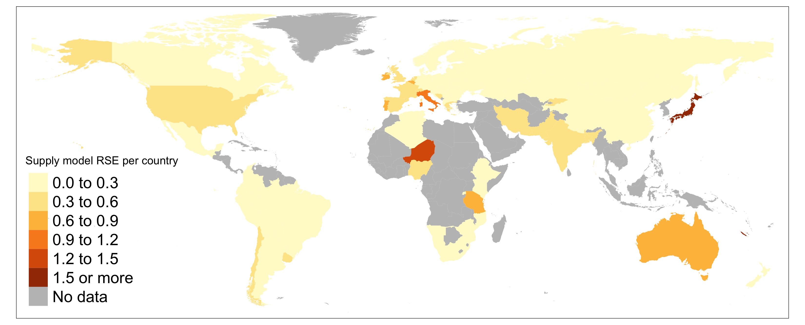
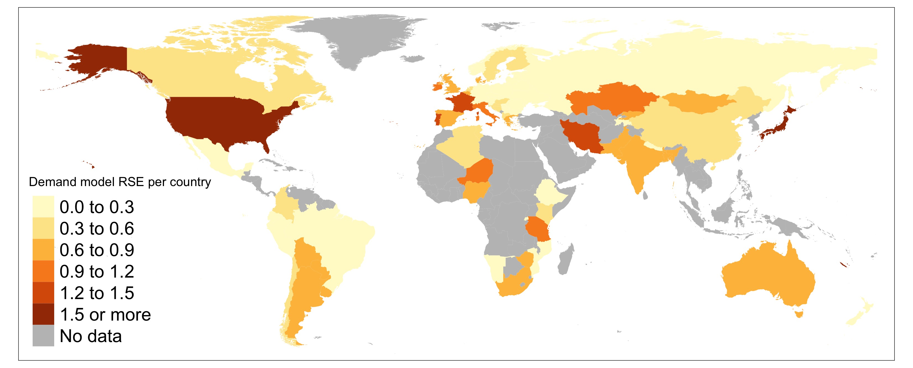
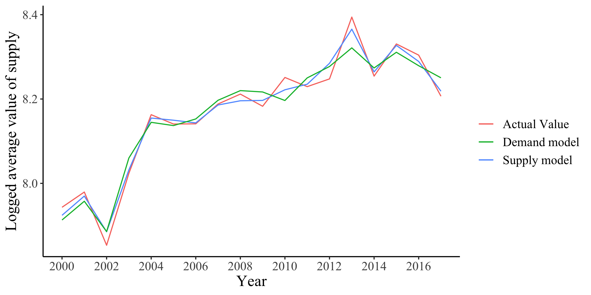

```{r setup, include=FALSE}
knitr::opts_chunk$set(echo = TRUE)
wordcountaddin::word_count("main_text.Rmd")
knitr::opts_chunk$set(fig.pos = 'H')
bookdown::pdf_document2
library(rmarkdown)
library(flextable)
library(DiagrammeR)
library(kableExtra)
```

\pagebreak

\pagenumbering{arabic}

# Abstract {.unnumbered}
Volatility in the supply and demand of wheat can cause global food security problems for people in emerging economies. Research into the causes of the volatility have mostly had a short-term, global approach. In this thesis, the *long-term* determinants of supply and demand for wheat will be investigated on a global and quantitative scale, with a focus on the effects of price. This will be achieved by making log-log, two-staged mixed effects models. The results show that a 1% increase in price results in a 0.244% decrease in supply and a -1.248% decrease in demand. Other drivers for supply are yield, the price of oil, previous year's wheat price and the composition of trade. The price of oil and previous year's wheat price are drivers of demand as well, complemented by population, the degree of urbanization, and GDP per capita.


\pagebreak

# Introduction

Currently, the global wheat supply is a hot topic, as price of wheat has increased by over 40% since the start of 2022. The conflict between Ukraine and Russia is seen as the main cause, as their combined pre-war export accounted for around a third of the global total. Russia is having difficulties exporting its grains due to the sanctions imposed [@reuters], and Ukraine is unable to export grains due to port blockades, theft and destruction. The turmoil has also caused global economical uncertainty as sanctions by the EU have lead to major increases of fossil fuel prices and in to turn global inflation [@Liadze;@nyt_inf].

Throughout time, wheat price spikes like these have been a reflection of economic crises, with the 1980s oil crash, the 1995 Asian market crash and the 2008 financial crisis showing that wheat prices increased as GDP growth rates decreased [@FAOSTAT;@gdpgrowth]. These are problematic situations, as a combination of the two has major consequences for food security, especially for poor people and people in emerging economies. @Braun calls it a double blow: poor people spend 50-70% of their income on food and the higher prices can make them, in times of economic crises, unable to adapt as their wages are not adjusted accordingly. Consequences are imbalanced diets and the inability to afford other essential goods and services, such as clean water, sanitation, education, and health care. @Hochman identified several causes of the spikes in 2007/08 and 2010/11. On the demand side, the rise in the prices of energy led to crops being used for biofuel, causing the demand to exceed supply. On the supply side it was due to a combination of bad weather and increasing production cost caused by increased energy prices. 

Several other studies that quantify the volatility of food demand, supply and price have been conducted [@janzen; @roache; @tadasse]. They focus on factors driving the *short-term* changes, including economic speculation and exchange rates. In the case of @janzen and @roache, the short term approach, in which they use monthly data, has got two downsides: long term factors, like GDP and population growth, cannot be included due to their values only being available with *yearly* intervals. Second, relevant monthly data is unavailable for many countries, forcing the researchers to take a US-specific or global approach. Although long term data is available for most countries [@FAOSTAT], attempts to investigate the long-term global drivers are limited, with papers mostly focusing on small regions [@Morris; @nepal; @ethiopia; @egypt]. 

Therefore, this thesis will attempt to investigate the long-term determinants on a global, quantitative scale. This will allow for the determination of the *global* price elasticity of supply and demand for wheat, as well as quantitatively confirming other drivers and their effects on its demand and supply. This will be done by constructing a log-log, two-staged mixed effects model for supply and demand, with yearly agricultural, socio-demographic and economic variables. 74 countries across 15 regions will be analysed over a period from 2001 until 2018. 

The choice to focus on wheat is, besides its current relevance, based on that it is used in diets across the world. This is partly due to its resilience, as wheat can be produced in many climates. Also, wheat has got a big presence in world trade: in 2002, the amount of wheat traded was greater than all other crops combined [@breadwheat].

Section 2 will provide some background information about supply and demand for wheat, and their relationship with price. Section 3 will explain which data was used, followed by the motivation of model choice and the operationalization of the variables in section 4. Section 5 will contain the results and lastly, section 6 will contain the conclusion and discussion.

# Background

According to economic theory, there are two functions explaining the relation between supply, demand and price. The first explains how much of a product the population is willing to *supply* at a given price. The higher the price, the higher the supply. The latter explains how much is *demanded* at a given price, where a higher price means lower demand. The point where the two functions cross is defined as the equilibrium point. Here, the quantity of the product sold and its price is defined. In reality, the supply and demand of goods are determined by many more factors than today's price. The following section will mention these factors in the case of wheat, and explain the reasons of their influence.

## Determinants supply
For a big part, how much wheat farmers are willing to supply at a given price comes down to the relative cost of production. The more wheat they are able to produce at a certain cost, the lower the price they are willing to supply it for. A way of capturing the relative cost of production is yield, which is defined as the number of tonnes of wheat produced per hectare of harvested area. Natural circumstances can influence yield, for example, a year of optimal weather leading to increases or a year with drought or plagues resulting in the opposite. According to @revol, technological advances are also major drivers of yield increase. A difference in yield changes the amount farmers are *able* to supply at a given price. The previous year's yield is also relevant: part of a harvest is put in stock, and thus a fruitful harvest the year before can leave farmers with the ability to supply leftovers.

A way in which farmers' production costs are directly influenced is through the rise of energy cost. The use of machinery causes them to have a high dependence on petroleum. Meanwhile, they only have limited abilities for fuel switching [@Schnepf] and thus, production becomes more expensive. On the contrary, government subsidies play a role in *decreasing* production cost. If the financial aid provides farmers with an incentive to innovate or switch to new technologies, their efficiency increases. Without these incentives, according to @subsidies, financial aid in many cases decreases productivity as it allows farmers to enjoy more leisure time. Either way, the relative cost of production for a farmer is lowered due to the influx in money. Furthermore, the price of other agricultural products changes how much farmers are willing to supply. For them, changes in the prices can make it attractive to either move away from growing wheat, start growing it, or grow more. 

When a country participates in global trade, two things might occur to local supply: simply stated, either foreign farmers might have a competitive edge to local farmers and are willing to supply more wheat for a certain price, or the *local* farmers might have this competitive edge and prefer selling cross border. In both cases, participation in global trade results in a change in the dynamics of supply. There is more to it than price however. @inttrade listed exchange rates, competitiveness, growing globalization, tariffs, trade barriers, languages, cultures, trade agreements, and transportation costs as ways that determine the degree of participation in international trade. Also, the yearly supply of a country is volatile and differs per country. This is visible in figure \ref{fig:plt1}, in which the supply of Portugal and Belarus are compared. Because of this, changes in supply can also be caused by *which* countries are trade partners, as their fluctuations in supply can be translated to the local market trough imports. 


```{r plt1, fig.cap = "Comparison of supply between Portugal and Belarus over the years, highlighting variation between countries' wheat supply", , out.width = "420px", echo=FALSE}



```


## Determinants demand

On the demand side, population is a first, rather obvious, determinant of supply. More people mean more quantity demanded at a certain price. The degree of urbanization of this population is, according to @Morris, also a driver of demand ^[Research focused on African countries]. This is because economic and demographic changes that come with urbanization lead to a change in food preference. An example is sub-Saharan Africa, where consumption of bread and wheat-based pasta products increased together with the degree of urbanization. Another determinant is the economic health of a country, for example the size of the gross domestic product (GDP) per capita. An increase in income means, if all other things remain the same, the ability and/or willingness to purchase more wheat at a certain price, as @Morris confirmed is the case for African countries. @chinadem found that in China, the increase in income led to a decrease in demand for *low* quality wheat, but a more substantial boost in demand for *high* quality wheat.

As is the case for supply, oil price changes influence demand. First, an increase in price comes with an increase in cost of living as, besides transportation, the purchase of other goods is also more expensive due to the earlier explained effects it has on supply. This leaves people with less money to spend on wheat products. Second, the increase in oil prices increases the demand of biofuels. Since wheat grains and straws can be converted to biofuel, its demand consequently increases as at a certain price it is a cheaper alternative [@Hochman]. Related to cost of living, the the demand of wheat depends on the price of comparable goods. Rye and rice can be considered supplementary to wheat, and increases demand for those, for example a price decrease, can go at the expense of the demand for wheat [@supp].

## Elasticity
One of the aims of this paper is to find the price elasticity of both supply and demand. The elasticity is a measure of how much supply or demand changes with a 1% change in price. It is expressed in equation \ref{eqn:elas}, in which price elasticity $E_p$ is determined by dividing the percentage change in demand or supply $Q$ by the percentage change in price $P$. These changes can be labelled according to the size of the effect. The relationship is inelastic when a 1% price change leads to a change in price of lower than 1%. A 1% change price leading to a change in demand of over 1% is labeled as elastic. When a change in price does not lead to a change in supply or demand (0%), the relationship is perfectly inelastic and lastly, when the change in supply or demand is equal to the change in price, it will get the label unitary elastic. Different goods tend to have different labels. On the demand side, types of food that are essential and not easily replaceable are inelastic, where luxurious food items tend to be elastic as they are *not* essential. On the supply side, food tends to be inelastic in the short-term as farmers and companies cannot quickly change their business. In the long-term they can, and thus long term elasticity of price *is* elastic.

\begin{equation}
\label{eqn:elas}
E_p = \dfrac{\%\Delta Q}{\%\Delta P} 
\end{equation}


# Data 
To convert the theory into numbers, data is gathered from the Food and Agriculture organization of the United Nations (FAO) in their database named @FAOSTAT. It contains a broad range of agricultural, social and economic records for over 245 countries and territories, with measurements starting in 1961. The agricultural data consists of a countries' crop production numbers, prices, trade, land use, FDI and government support of farming. The social and economic records include consumer price indices, population numbers, employment levels and GDP.

The full database contains information of 245 countries and territories. However, not all of these can be included in the analysis due to unavailability of records of interest. The reasons as to why this data is absent are, first, poor bookkeeping due to civil unrest (e.g. Sudan) and second, the unavailability of producer prices, as wheat has simply not been produced in the country and therefore a price has never been established (e.g. Suriname). The list of the 74 countries that *are* used in the final model can be found in [appendix 1](#ap1). According to the metadata, FAO has also dealt with missing data themselves. The missing values were imputed based on "semi-official or non-official sources, auxiliary variables, technical conversion factors and statistical and econometric techniques" [@FAOSTAT]. 

Not all of the needed data has the same span of time. Although some data is collected from 1961 onwards (e.g. GDP), the first year for which all needed records are present is 2000, as this is the year in which FAO's started keeping track of the consumer price index. Population numbers are only available until the year 2018, making that the final complete year. Due to biyearly reporting or other data missingness, not all countries have records for each year. Therefore, the final dataset contains 1206 out of the 1258 possible observations. Additional data was obtained from other sources; oil price data is obtained from @ourworld and the *global* consumer price index (CPI) data is obtained from @cpidata. 

# Methodology

## Model

The data will be used to create a mixed effect, log-log, two-staged regression model. It being a mixed effects implies that the model can contain both random intercepts and effects. This is necessary because the data's hierarchy, consisting of three levels: there are yearly observations which are nested in a country, which are in turn nested into geographical regions. The resulting variable coefficients of a mixed effects regression analysis with random intercepts will be the same as the ones of a regular linear regression. However, a mixed model will take this hierarchical structure into account by, rather than calculating a global intercept, generate an intercept for each region. When estimating a region's supply, this intercept allows each country to have a more accurate fit. Besides having region-specific intercepts, using a mixed model also allows for taking into account the effect time has on supply. In the models, this will be done by allowing each country to have a random intercept and slope for the *year* variable. 

In order to directly obtain the price elasticity from the regression, the model will be a so called log-log. This means that the dependent variable as well as the independent variables of interest will be log transformed. The resulting regression coefficients will represent the % change to the independent variable with a 1% change in the dependent variable. 

So far, it has been discussed how supply and demand *depend* on price, which translates into quantity being the dependent variable and  price the independent variable. An important, yet unmentioned element of the supply and demand dynamics is how they *influence* price. A demand higher than supply causes scarcity, making consumers willing to pay a higher price. When there is more supply than demand, there is abundance, and farmers are willing to ask a lower price to get rid of their stock. A model in which the dependent variable also influences the independent is called a simultaneous equation model, and contains bias due to the presence of reverse causality. One of the assumptions of a linear model is that variables are uncorrelated with the error term. This assumption is violated with the presence of reverse causality: in this case, price is correlated with the error term. To account for this, the method of two-staged least squares estimation is used. Besides the functions of supply $S$ and demand $D$, a model of price will be established, consisting of the combined predictors of supply and demand, excluding price. The fitted values $\hat{P}_{cym}$ for each country $c$ and each year $y$ that result from this model will represent price in the demand and supply model. 

International trade will be considered in the supply models. As including import accounts of all countries as variables will lead to convergence problems, a selection of countries will have to be made. To determine which is the optimal selection of countries to include, three different groups $m$ of to-be-included countries will be made, each with a different way of being important to global trade. The first group will contain the top 5 global traders throughout the time frame, obtained by summing the amounts of wheat each country has traded anywhere throughout the time, picking the five with the highest value. The second selection consists of the top trader from each region. The last contains the five countries of which is most commonly imported from across the world. These countries are found by, for each country, listing the ten countries they imported most from, and then summing these top ten occurrences. 

Equation \ref{eqn:eq_dem} displays the demand model in which $Q_{Dcym}$ expresses demand, equation \ref{eqn:eq_sup} displays the supply model in which $Q_{Scym}$ expresses supply, and equation \ref{eqn:eq_pri} displays the price model in which $P_{cym}$ expresses the price. The $\hat{P}$ in equation \ref{eqn:eq_dem} and \ref{eqn:eq_sup} is the fitted value resulting from $P_{cym}$. $DV$ and $SV$ represent all variables besides price that will be included in respectively the demand and supply model, and $i$ and $j$ are their count. $D$ represents demand, $S$ represents supply, $c$ the country, $y$ the year, and $m$ the three country groups. The following section describes what variables $DV$ and $SV$ are made up of. 


\begin{equation}
\label{eqn:eq_dem}
Q_{Dcym} = \beta_{0Dcym} + \beta_{1Dm}\hat{P}_{cym} +  \beta_{iDm}DV_{icym} + \epsilon_{Dm}
\end{equation}

\begin{equation}
\label{eqn:eq_sup}
Q_{Scym} = \beta_{0Scym} + \hat{P}_{cym} +  \beta_{iSm}SV_{icym} + \epsilon_{Sm}
\end{equation}

\begin{equation}
\label{eqn:eq_pri}
P_{cym} = \beta_{0Pcym} + \beta_{iPm}DV + \beta_{jPm}SV + \epsilon_{Pm}
\end{equation}


In order to test the validity of the results, the regression model assumptions of linearity, homogeneity of variance and normal distribution of residuals will be checked. 


## Variable operationalisation

### Supply, demand and price

For both the supply and demand elasticity models, a country's total supply in 1000 tonnes is used as the dependent variable. The value is the balance of four different factors: the amount of wheat produced, plus the amount imported, minus the amount exported and the changes in stock either added or subtracted. Although having the value of supply depicting the demand might not be a completely accurate measurement of wheat (e.g. there might be more demand but the shelves are empty), it is the only quantitative measurement available. 

$P_{cym}$ is represented as each country's yearly producer price in US dollars. To account for inflation, the value will be divided by the country's consumer price index of that year. As mentioned, price will be represented in the supply and demand model as the *fitted* values. The actual values of $P$ will also be included with a one-year lag. This is because a farmer's production decisions translate to changes in their harvest a growing season later. Also included in both the demand and supply model is the global oil price. This variable is present as the yearly US dollar price per barrel, and is inflation adjusted by being divided by the *global* CPI (consumer price index). As mentioned, the models will account for the effect of time. Therefore, another variable present is the year, with 2000 being year 0. 

### Supply 

First, the yearly yield per country is obtained from FAOSTAT as tonnes of output per hectare of harvested area. The value will be log-transformed. To account for the influence of trade on supply, the *relative* amounts of the four elements making up supply (export, import, stock variation and production) are included. The relative amount, obtained by dividing the elements by the total amount of supply, is taken because summing the values of each of these factors equals the supply quantity, and is therefore not a legitimate addition to a regression model. In this form, the variables can still capture dynamics. For example, the use of relatively more stock can indicate wheat shortage and therefore less supply, and a relatively bigger export can indicate surplus and therefore more supply. Due to a correlation with import (correlation coefficient of -0.83), the relative value of production will not be considered. 

The FAOSTAT dataset also contains the amounts of between-country wheat trade. Therefore, total import can be broken down into the amounts a country imported from each of the other countries. Doing this allows for comparison of their effects and determine which countries are bigger drivers of the supply amounts. The previous section mentioned how this is incorporated in the analysis: three different models will be made, each with the import accounts of a different selection of countries. As is the case for the elements making up for supply, the *relative* value will have to be taken. This will be done by dividing the the amount of tonnes of imported from a country by the total of tonnes of imports. Table \ref{tab:countries} shows which countries are present in each of the three models.


```{r countries, echo=FALSE}

countries_tbl <- read.csv("tables/countries_used.csv", check.names=FALSE)


#knitr::kable(list(c_1, c_2,c_3), "latex")
countries_tbl[,-1] %>%
  kbl(caption= "Countries considered in each of the models", booktabs = T) %>%
  kable_styling(latex_options = c("scale_down","HOLD_position"))


```

At last, several interaction effects will be included. Firstly, the interactions between between yield and the relative components of supply (import, export and stock variation, excluding production) as changes in yield change the composition of the supply; for example, it is likely that with a low yield there are relatively fewer exports. Secondly, interaction terms between oil and both relative import and export will be included. This because pricier oil makes importing and exporting also more expensive, as the cost of transportation increases [@oilprice].


### Demand  
First, the demand model will contain the yearly log-transformed value of all countries' population. The degree of urbanization is represented by the amount of people living in an urban area, divided by the total population of that year. A normalized version of GDP is also included, for which the value is divided by population to obtain the GDP per capita, follwed by a log-transformation. 

As mentioned in section 2, the prices of supplementary goods and global wheat prices are two factors that, according to economic theory, influence the supply and demand. However, due to autocorrelation between the wheat producer prices, the two could not be included in the demand model. The described government aid for farmers could not be included in the *supply* model due to limited data availability. 

Figure \ref{fig:sch1} shows the variable framework of both the supply and demand model. Table \ref{tab:desc} shows the descriptive statistics of the variables.

```{r sch1, fig.cap = "Framework of the variables included in the supply model, and the direction of their effects.", echo=FALSE, out.width = "420px"}

```

```{r desc, echo=FALSE}
descriptives <- read.csv("tables/descriptives.csv", check.names=FALSE)
descriptives[9,"Max"] <- "$1.574^1$"
descriptives[12,"Max"] <- "$1.571^2$"
table_des <- descriptives %>%
  kbl(caption= "Descriptive statistics of the variables used in the models. N=1206 for each variable.", booktabs = T, escape = FALSE) %>%
  kable_styling(latex_options = "scale_down") %>%
  column_spec(2, width="7cm") %>%
  footnote(general= c("1 the value can exceed one, as exports are subtracted from supply","2 In the case of Nigeria, the proportion exceeds one (value of 1.571). Because this should not be possible, the observation", "will not be considered in the analysis. The maximum value would be 0.98 in that case."))
table_des
```

\newpage

# Results
## Supply models
Table \ref{table:table_supply} shows the results of each of the three supply-based regression models, with model 1 containing the Top 5 global traders, model 2 the top trader from each region and model 3 the most common trade partner globally. The coefficients for price are negative, and indicate that a 1% increase in price, ceteris paribus^[ceteris paribus means "With other conditions remaining the same" and holds for all statements on effects in this section], leads to a 0.232% to 0.244% decrease in supply. The values are significant at $p>0.05$ for all three variations. The lagged inflation adjusted value of price is also significant in all three models, however, on the lowest significance levels ($p<0.001$). Its coefficients range from 0.151 to 0.162, showing that supply *increases* when last year's price increases. The same is the case for the price of oil, with coefficients of 0.112, 0.106 and 0.114. Yield is also significant at the lowest level for all three models, The coefficients of 0.718, 0.758 and 0.718 respectively are the highest of the log-transformed independent variables, meaning that of these, supply changes most with a change in yield. 

All included components of supply, import, export and stock variance, show significant effects on price in their relative form. The relation between import and supply is positive, meaning that an increase in relative imports increases demand. The values for exports are negative, thus its positive relationship means that relatively *fewer* exports lead to higher supply. The sign of stock variance is also positive. From this can be concluded that stocking up relatively less or using relatively more stock is reflected in a higher supply. The interaction terms between these components and yield are all significant at $p<0.05$. The signs are negative, indicating that the factors being a larger proportion and/or the yield being higher go with a lower effect on supply.

The three models differ based on the selection of countries. In both model 1 and 3 none of the included countries have significant effect on supply. In model 2 however, the relative import of Spain, South Africa, Kazakhstan and the United Kingdom do have significant coefficients ($p<0.05$). Relatively more imports from Spain, South Africa and Kazakhstan leads to lower supply, where more imports from the United Kingdom increases supply.

To determine the relative quality of the three models, a look will be taken at the AIC (Akaike Information Criterion) and BIC (Bayesian information criterion) values. The AIC uses the maximized likelihood estimate and the number of parameters to estimate the information lost in the model. The BIC does the same, but induces a penalty for each extra parameter used in the model to account for overfitting. For both criteria, a lower comparative value indicates a higher quality model. The measures therefore tell us that the quality of model 3 is the highest. Model 1 and 3 are similar in nature and therefore their AIC and BIC values are too.

\input{"tables/results_sup.tex"}

## Demand models
Table \ref{table:table_demand} shows the demand models. All included variables are significant at $p<0.01$, with exception of the year, which is significant at $p<0.05$ in models 1 and 3, and at $p<0.1$ in model 2. The coefficients of $\hat{P}$ are larger than its values in the supply model, being -1.247, -1.016 and -1.248 respectively. Since the values of model 1 and 3 are above one, the demand of price is elastic in these models: a 1% change in price leads to a drop in demand greater than 1%. The coefficient of model 2 is about one, which indicates unitary elastic demand. The coefficients of the previous year's price are also higher for demand, with a 1% change resulting in a change in demand of 0.456% (model 2) or 0.532% (model 1 and 3). An increase in the price of oil *also* leads to an increase in demand, with the coefficients ranging from 0.232 (model 2) to 0.301 (model 3). 


The coefficients of population are nearing unitary elastic demand demand, as its values are close to 1 (0.892, 0.896 and 0.892 respectively). Both the percentage of a country living in a city and the value of the GDP per capita have a positive relationship with the demand. The coefficient of the variable for year is almost zero (-0.017, -0.011 and -0.017) and therefore perfectly inelastic. Looking at the AIC and BIC, model 1 can be considered of the highest quality, with model 3 a close second. 

Table \ref{tab:intercepts} shows all models' random intercepts of each region. As mentioned, each country was also given random slopes and intercepts for year variable. [Appendix 2](#ap2) shows these for the best performing supply and demand model. The regression results of $\hat{P}_1$, $\hat{P}_2$ and $\hat{P}_3$ can be found in [appendix 3](#ap3). 

\input{"tables/results_dem.tex"}


```{r intercepts, echo=FALSE}
intercepts <- read.csv("data/intercepts.csv", check.names=FALSE)
table_int <- intercepts %>%
  kbl(caption= "Random intcercepts per region for the demand and supply models of each of the three variations", booktabs = T) %>%
  add_header_above(c(" ", "Model 1" = 2, "Model 2" = 2, "Model 3" = 2)) %>%
  kable_styling(latex_options = "scale_down")
table_int


```


## Assumption checking
To justify the use of the model and determine if conclusions can be drawn from the results, tests to detect linearity, homogeneity of variance and normal distribution of residuals are performed. To check for linearity, scatterplots were made showing the residuals of the dependent variable. In these, no patterns could be detected confirming the absence of linearity. There is no systematic approach for testing the homogeneity of variance in mixed models [@homogen] and therefore its hard to confirm its absence. 


## Error comparison
In order to see the model's performance per country, the relative squared error (RSE) over the timespan is calculated by dividing the mean squared error (MSE) by the square of the difference between the actual and the mean of the data. The choice for a relative measure is made to allow for comparison between countries with different supply amounts. Figure \@ref(fig:sup) shows the error for the best performing supply model (model 3) and figure \@ref(fig:dem) the best performing demand model (model 1). The closer the value is to zero, the better. A value above 1 means the model's predicted value is worse than simply taking the mean. [Appendix 4](#ap4) shows the the RSE value for each country. 

Comparing the two maps, it is clear that the relative errors of the supply model are generally lower than those in the demand model. No clear pattern of inflated errors is visible in the maps. One country that stands out for having high errors in both maps is Japan. This is due to the several yearly supply values being close very close the mean of the whole time span, inflating the value of the RSE. 

\ref{fig:plt1} shows the models' logged *average* predicted values for wheat over the years, together with the actual values. This tells that for most years the supply model's values are closer to true values than the demand model's values. The accuracy is highest in the period from 2000 to 2008. A note is that these are the fitted values, and thus these results do not show the predictive performance. Testing the models on stratified samples *would* reveal this. 

```{r sup, fig.cap = "Relative squared error (RSE) of the best performing supply model (model 3)", echo=FALSE, out.extra=''}

```

```{r dem, fig.cap = "Relative squared error (RSE) of the demand model", echo=FALSE, out.extra=''}

```

```{r plt2, fig.cap = "Average logged actual value and average predicted values over the years", , out.width = "420px", echo=FALSE}



```


# Conclusion and discussion

When considering the best performing model, the price elasticity of supply is -0.244 and therefore inelastic. The sign being negative goes against economic theory, as farmers are not expected to supply less when the price increases. Although inelastic, previous year's price does have a positive sign, indicating that farmers do make the decision to produce more, which translates into the next harvest. Both this year's price and previous year's price being inelastic might be because food producer prices tend to move together [@vatsa]. An increase in the price of wheat therefore makes switching to produce it not more attractive than any other crop. It is also unexpected that the coefficient of oil price is positive, meaning that farmers do not supply less when utilizing their machinery is more expensive. The interaction between the oil prices and relative import and export shows, however, that an increase in oil price reduces the effect of both, supporting the theory that rising oil prices hampers trade. The positive effect of yield is also in line with economic theory: farmers are able to supply more when their harvests are good. On the contrary, no effect is present for the lagged yield variable.

The significance of the import, export and stock variance variables show that the dynamics of the trade composition matter in determining supply. From this can be concluded that higher *import*-dependence results in more supply and higher *export*-dependence to less. This is possibly a proxy for a country's development: for lower income countries, agriculture tends to be a big part of their employment, livelihood and income [@arg]. The significance of the interaction terms between the components of supply and yield signal that an changes in yield do also change their effects. A higher yield reduces the effect of relative import and more relative export.  None of the country's import proportions show significant effect on supply. It is plausible that using import proportions is not the way to represent the dynamics of trade, as the measure is not able to capture the complexity of trading described in section 2.1. 


The price elasticity of demand is -1.248. This means it can be classified as an *elastic*, suggesting that people have a tendency to substitute wheat from their diets when prices increase. The positive sign of the lagged price suggests that people tend to buy more the higher previous year's was. As is the case for the supply model, the positive sign of the price of crude oil is unexpected. Either an unmentioned effect might be the cause, or the effects of oil price changes are captured by another variable. 

Interestingly, the relation between the percentage of urban population and demand is significant, which is something that was not the case in the Africa-specific research of @Morris. This could be, according to @byerlee, because for governments it may be easier to increase food supplies for growing urban populations by increasing grain imports than by increasing the production of the agricultural sector. 
The elasticity between population and demand is close to 1 and therefore about elastic. This makes sense: more people lead to more mouths to feed. Although GDP per capita is also a significant determinant of supply, its effects are minor in elasticity terms (0.103). This may be because at a certain point of wealth, people do not want more bread as they either are nourished or prefer substitutes. 

There are numerous ways the models can be improved. First, several variables were not included due to correlation with other variables. For example, the world wheat price, price of other crops, and production. Second, the way price is used in the demand model is flawed. Now, rather than *market* price, the *producer* price was used as a measure. Data on the market price was only available for a select group of countries and years. Even though producer price has been a fairly constant proportion of market price [@marketprice], enough trends and fluctuations have been present to induce bias. Third, the measurement of supply is not a measurement of farmer behavior per sé and therefore the price elasticity of supply might not be accurate. Although supply and demand equations could be constructed with the used quantity, in hindsight, a measure like the amount of acres on which wheat is grown would be able to capture the *attempted* increase in production by leaving out trade and yield. Thus, a more accurate price elasticity of supply and demand can be discovered with additional research.


\pagebreak

# References {.unnumbered}

<div id="refs"></div>

\pagebreak

# Appendix {.unnumbered }

## Appendix 1 {.unlisted .unnumbered #ap1}
Countries of which records are included in the regression model, as well as the region they are in.

```{r, echo=FALSE}
table_c <- flextable(read.csv("Appendix/countriesused.csv"))
table_c %>% width(j = NULL, 3, unit = "in") %>%  fontsize( i = NULL, j = NULL, size = 8, part = "body") %>%
  line_spacing(i = NULL, j = NULL, space = 0, part = "all", unit = "in")


```
\pagebreak
## Appendix 2 {.unlisted .unnumbered #ap2}
Random slopes and intercepts for the year variable in the best performing supply and demand models.
```{r, echo=FALSE}
table_is <- flextable(read.csv("Appendix/int_slop.csv", check.names=FALSE))
table_is %>% width(j = NULL, 1.1, unit = "in") %>% 
  fontsize( i = NULL, j = NULL, size = 8, part = "body") %>%
  line_spacing(i = NULL, j = NULL, space = 0, part = "all", unit = "in")
```

## Appendix 3 {.unlisted .unnumbered #ap3}

\input{"tables/results_price.tex"}


## Appendix 4 {.unlisted .unnumbered #ap4}
RSE values per country, for each of the three models.
```{r, echo=FALSE}
table_e <- flextable(read.csv("Appendix/country_errors.csv", check.names=FALSE))
table_e %>% width(j = NULL, 1.9, unit = "in") %>%   fontsize( i = NULL, j = NULL, size = 8, part = "body") %>%
  line_spacing(i = NULL, j = NULL, space = 0, part = "all", unit = "in")

```


